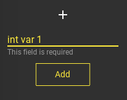

# Algorithm_Engine

## Setup
Let's begin with cloning this repository:
```python git clone https://github.com/MrSinho/Algorithm_Engine```
Now run the ```main.py```, you'll see something like this: 

## Overview
In the ```Start``` function you have to write some basic code which will run just at the beginning of the script, the ```Update``` function runs/is updated every time your machine makes a new frame. On the left you have the ```variables``` data table, which contains the variables you're going to use. If you click the plus icon, you can add, rename, and change the type and value of a variable. 
Example: 
- We want to add a variable x, we need to give the ```type``` ```name``` and ```initial value```: ```float x = 0```
- Now let's rename it to y: ```rename x y```
- We also need to change the value to bool: ```type y bool```
- The initial value is too small, we want something bigger: ```value y 9.8```



## Load some examples

We want just to load some saved example, so we're going to click the ```folder icon``` in the toolbar. You'll see a popup window, write ```Lorenz Attractor``` in the input field.
Now we have loaded the ```Lorenz Attractor``` equation.


We have to specify which variables will represent which axis: for now the ```x``` will represent the ```x axis```, the ```y``` for the ```y axis``` and the ```z``` for the ```z axis```.


The last thing we need to do is choosing what we want to see in the three-dimensional graph: some lines, or some dots? Let's select the first option for drawing lines.


Run the attractor by clicking ```Run```.

As you can see, it's working!


