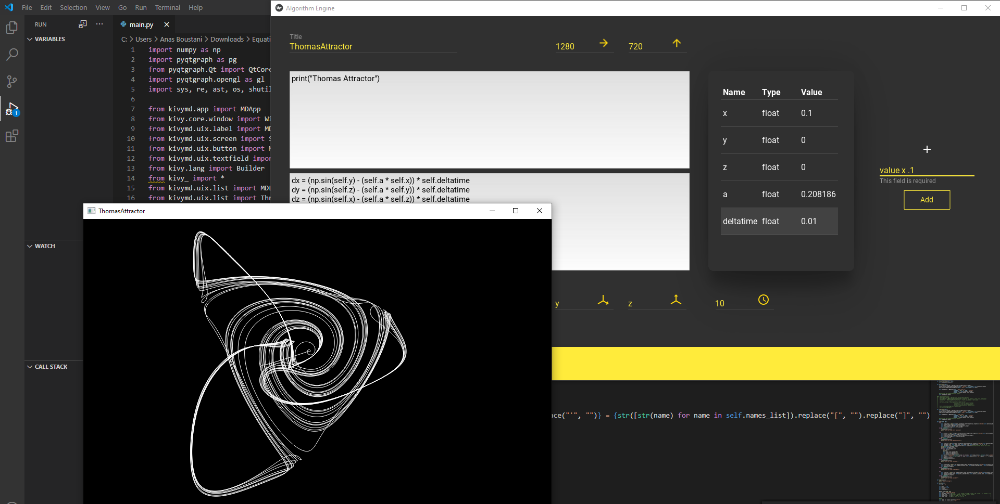
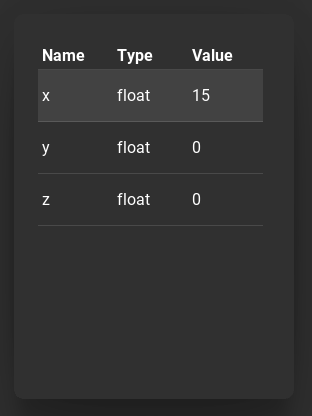
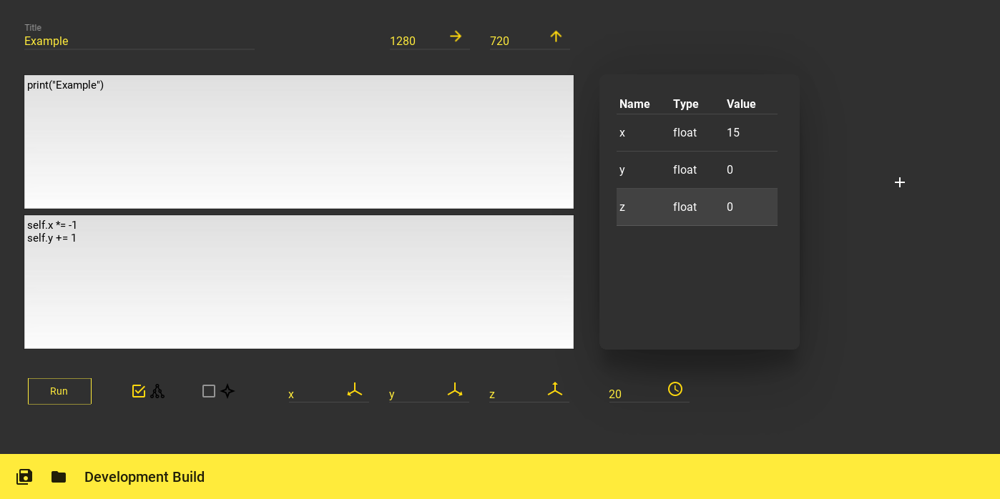

# Equation Engine

Why this? This can be useful on many fields: you can use it to view and corfirm physics equations or simulate some physics experiments, with almost no coding knowlege. PyQtGraph (the module that made this repository possible) was born for scientific visualization, and I wanted to do something which does the same job, in an easier way.

## Setup
Let's begin with cloning this repository:
```git clone https://github.com/MrSinho/Equation_Engine```

open the terminal with the virtual environment, and type 
```python
pip install kivy kivymd pyopengl numpy pyqtgraph
```
Now run the ```main.py```, you'll see something like this: 


## Overview
In the ```Start``` function you have to write some basic code which will run just at the beginning of the script, here you can also import custom libraries; the ```Update``` function runs/is updated every time your machine makes a new frame. On the left you have the ```variables``` data table, which contains the variables you're going to use. If you click the plus icon, you can add, rename, and change the type and value of a variable. 
Example: 
- We want to add a variable ```var```, so we have to give the ```type``` ```name``` and the ```initial value``` or ```var```: ```int var = 1```
- Now let's rename it to x: ```rename var x```
- We also need to change the value to float: ```type x float```
- The initial value is too small, we want something bigger: ```value x 15```


Let's write our first equation: first, we need to add more variables, click on the ```plus``` icon, and write ```float y = 1```, ```float z = 0```.



In the ```Start``` function we'll print the name of the equation, just for fun: ```print("Example")```. 
In the ```Update``` function we'll turn x to negative, then to positive, and so on... ```self.x *= -1```, and y will slowly increase by 1 ```self.y += 1``` So this is the final result:
```python
self.x *= -1
self.y += 1
```
We have to specify which variables will represent which axis: for now the ```x``` will represent the ```x axis```, the ```y``` for the ```y axis``` and the ```z``` for the ```z axis```.


You'll also notice an input field with a clock icon on the right: this represents the update delay in milliseconds, which means how fast will the code update. We'll give an input of ```20``` milliseconds.


We also have to choose what to see in the three-dimensional graph: some lines, or some dots? Let's select the first option for drawing lines. Note: the dots option is not fully optimized.


If you go up you'll see there are some more required field: the one on the upper left corner is the title of what we're doing, I'll type ```Example``` inside. On the right, the other ones tell the default width and height of the window with the 3d environment. Let's make a width of ```1280``` pixels and a height of ```720``` pixels.


Before running, let's save what we've done: click on the save icon of the toolbar (down left corner), then give a name to the code:


Now execute the code by clicking the ```Run``` button.



This is the final result:


## Load some examples
You can load (by clicking the folder icon on the toolbar) more examples, such as the ```Lorenz Attractor```, the ```Thomas Attractor```, and the ```Logistic Map```, which are on this repository by default. You can also write, save, and load your equations.


Made by [Sinho Graphics](https://www.instagram.com/sinho_graphics)
