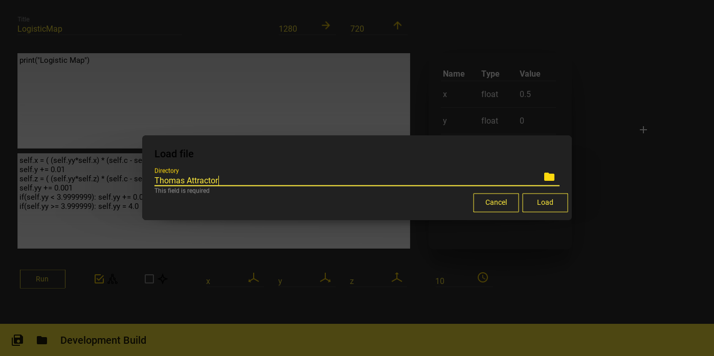

# Equation Engine

## Setup
Let's begin with cloning this repository:
```git clone https://github.com/MrSinho/Algorithm_Engine```
Now run the ```main.py```, you'll see something like this: 


## Overview
In the ```Start``` function you have to write some basic code which will run just at the beginning of the script, the ```Update``` function runs/is updated every time your machine makes a new frame. On the left you have the ```variables``` data table, which contains the variables you're going to use. If you click the plus icon, you can add, rename, and change the type and value of a variable. 
Example: 
- We want to add a variable x, we need to give the ```type``` ```name``` and ```initial value```: ```int x = 1```
- Now let's rename it to k: ```rename x k```
- We also need to change the value to float: ```type k float```
- The initial value is too small, we want something bigger: ```value k 9.8```


Let's write our first equation: first, we need to add more variables, click on the ```plus``` icon, and write ```float x = 0```, ```float y = 0```.


In the ```Start``` function we'll print the name of the equation: ```print("Quadratic Proportionality")```. 
In the ```Update``` function we'll write the simple formula, where: ```y = k*x2```. We can't do this, because we're writing inside a class, and to power the ```x``` we'll use the ```power```funtion from ```numpy``` so it's going to be: ```self.y = self.k*np.power(self.x, 2)```. We'll also make the independent variable ```x``` increase by a small number. So this is the final result:
```python
self.y = self.k*np.power(self.x, 2)
self.x += 0.1
```
We have to specify which variables will represent which axis: for now the ```x``` will represent the ```x axis```, the ```y``` for the ```y axis``` and the ```z``` for the ```z axis```.


The last thing we need to do is choosing what we want to see in the three-dimensional graph: some lines, or some dots? Let's select the first option for drawing lines.


Before running, let's save all what we've done: click on the save icon of the toolbar, then give a name to the code:


Now execute the code by clicking the ```Run``` button.

## Load some examples

We want to load a saved example, so we're going to click the ```folder icon``` in the toolbar. You'll see a popup window, write ```Lorenz Attractor``` in the input field.
Now we have loaded the ```Lorenz Attractor``` equation.



We have to specify which variables will represent which axis: for now the ```x``` will represent the ```x axis```, the ```y``` for the ```y axis``` and the ```z``` for the ```z axis```.


The last thing we need to do is choosing what we want to see in the three-dimensional graph: some lines, or some dots? Let's select the first option for drawing lines.


Run the attractor by clicking ```Run```.

As you can see, it's working!


You can do same process with some more examples, such as the ```Thomas Attractor```, and the ```Logistic Map```. You can also write, save, and load your equation.

Made by Sinho Graphics
